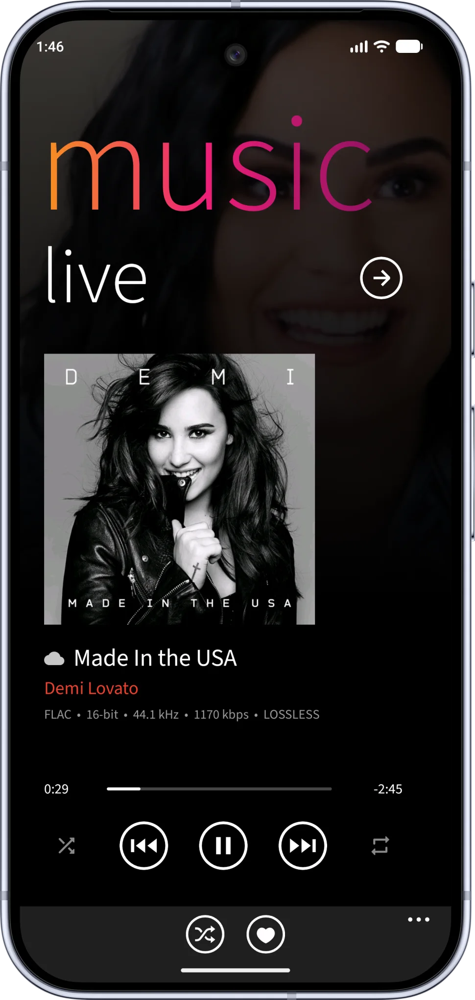
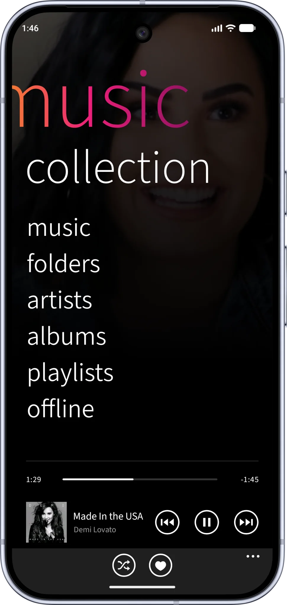
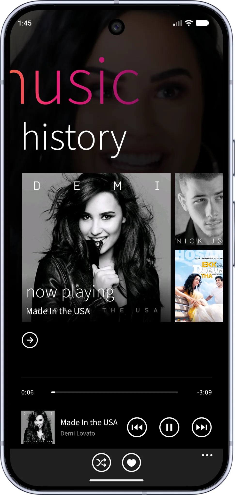
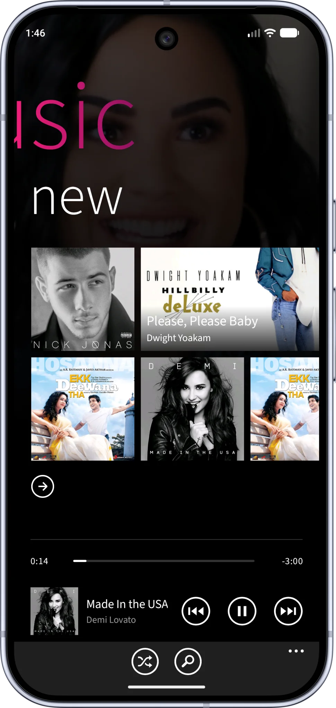

<p align="center">
  
</p>

<h1 align="center">Sonetro — Offline Music Player</h1>

<p align="center">
  <strong>A polished, local-first music player for Android, built with Kotlin and Jetpack Compose.</strong>
</p>

<p align="center">
  
  
  
  
</p>

## Overview

Sonetro brings music stored on your device and optional personal music servers into one library. Its panoramic Home connects Live playback, Collection, History, and New, with responsive controls and artwork-led browsing.

Playback continues in the background through a media session service. Library discovery, playback state, offline downloads, widgets, and settings are handled on the device; no Sonetro account is required.

<p align="center">
  <a href="https://github.com/Moajjem/Sonetro-Releases/releases/latest"><strong>Download the latest release</strong></a>
  &nbsp;·&nbsp;
  <a href="https://github.com/Moajjem/Sonetro-Releases/releases/tag/v1.1.927">See what’s new</a>
  &nbsp;·&nbsp;
  <a href="https://github.com/Moajjem/Sonetro-Releases/issues">Get help</a>
</p>

---

## Meet your music

<p align="center">
  <a href="assets/screenshots/live.webp"></a>
  <a href="assets/screenshots/collection.webp"></a>
  <a href="assets/screenshots/history.webp"></a>
  <a href="assets/screenshots/new.webp"></a>
</p>

<p align="center"><strong>Live</strong> · <strong>Collection</strong> · <strong>History</strong> · <strong>New</strong></p>

Swipe through a panoramic Home, revisit songs in History, discover recent additions in New, and open any song in Live. The interface adapts to different phone sizes while keeping playback close at hand.

## At a glance

| | |
| --- | --- |
| Platform | Android 6.0 or newer |
| Current release | [1.1.927](https://github.com/Moajjem/Sonetro-Releases/releases/tag/v1.1.927) |
| Distribution | Signed APK in the [Releases](https://github.com/Moajjem/Sonetro-Releases/releases) section |
| Account | No Sonetro account required |

## Features

### Listen

- Play device music and tracks from a connected personal server.
- Continue listening in the background with notification, lock screen, headset, and compatible car controls.
- Use the Live player, mini-player, queue, seeking, shuffle, repeat, and playback controls.
- Resume the current track and queue after an interruption or app restart.
- Adjust playback with equalizer presets and other audio settings.

### Explore your library

- Browse songs, folders, artists, albums, playlists, favorites, and offline music.
- Search across available library content and move from a song list directly into Live playback.
- Use the panoramic Home view to move between Live, Collection, History, and New.
- See recent and newly added tracks in mixed-size artwork tiles. The featured History tile shows the current playing or paused state.
- Organize playlists and manage local files through Android's confirmation flows.

### Make it yours

- Choose appearance and accent colors, and use artwork in the app background.
- Add custom song or artist background images.
- Add adaptable home screen widgets with artwork, transport controls, and playback progress.
- Use layouts that respond to screen size, display density, and text settings.

## Install or update

1. Open the [latest release](https://github.com/Moajjem/Sonetro-Releases/releases/latest) on your Android device.
2. Download the `Sonetro-<version>-release.apk` asset.
3. Open the downloaded file and follow Android's installation prompts. Your browser or file manager may need permission to install apps.

To update, install the newer signed APK over the existing app. Keep the installed app in place if you want to retain its data and settings. Android accepts an in-place update only when the APK has the same application ID, a compatible signing certificate, and a suitable version code.

**Release 1.1.927 verification:** SHA-256 of `Sonetro-1.1.927-release.apk`:

```text
d26be39c7b15658eabfbd5bed4c9a6711937d7fab85f76eb3a3713f0e99b73f3
```

## How Sonetro is built

Sonetro is a Kotlin app with a Jetpack Compose interface. Its major parts work together as follows:

```text
Device music ── Android media library ──┐
                                         ├── Unified library ── Browse and search
Personal server ── Provider adapters ───┘          │
                           │                        └── Playback queue
                           └── Sync and downloads             │
                                    │                 Media session service
                              Offline storage                 │
                                                    App, system controls, widgets
```

| Layer | Responsibility |
| --- | --- |
| Interface and navigation | Compose screens, the Home panorama, responsive layout rules, and transitions between lists and Live. |
| Library state | A lifecycle-aware view model combines device tracks, server catalog entries, playlists, favorites, history, and the active queue into observable UI state. |
| Device library | Android's media library supplies local tracks and metadata; Sonetro refreshes when the device library changes. |
| Server integration | Provider adapters connect to configured personal servers and present their catalogs alongside device music. |
| Playback | A Media3 media library service owns the player and session so playback and system controls continue outside the app screen. |
| Offline music | Background workers synchronize catalog data and manage downloads. A local SQLite store tracks server catalog and offline state. |
| Widgets | Android widgets read playback state and provide artwork, progress, and transport actions. |
| Preferences | On-device settings retain appearance, playback choices, and library configuration. |

This is an architectural overview of the app, not a claim that this releases repository contains its source code. The releases repository hosts installable builds and user-facing release information.

## Music sources and connectivity

Device music is available after granting Android's audio access permission. Personal server access is optional and requires a server you can reach from your device. Server authentication, library selection, and offline downloads are managed in the app's settings.

A network connection is needed for server discovery, streaming, and synchronization. Tracks downloaded for offline listening remain available when the server is unreachable. Availability can depend on the file, server configuration, connection, and Android device.

## Privacy and permissions

Sonetro has no app account requirement, advertising SDK, or analytics SDK. Library data, preferences, playlists, and listening history are kept on the device. When you configure a personal server, the app connects to that server for the features you choose to use.

Android may ask for access to audio files and notifications. Background playback uses a foreground media service. Deleting or changing local files may trigger an Android system confirmation. Grant only the permissions needed for the features you use.

## What's new in 1.1.927

- Redesigned Home with smoother panoramic scrolling.
- Added wider History and New views with mixed-size music tiles.
- Added a featured History tile with playing and paused status.
- Made song taps in Home tiles and library lists start playback and open Live with a smooth transition.
- Improved layout, alignment, and typography across screen sizes.
- Simplified source indicators: cloud tracks show a cloud icon; local tracks have no icon.

[Read the full release notes and download 1.1.927](https://github.com/Moajjem/Sonetro-Releases/releases/tag/v1.1.927)

## Help and feedback

For a problem or feature request, [open an issue](https://github.com/Moajjem/Sonetro-Releases/issues). Include the Sonetro version, Android version, device model, music source, and steps to reproduce the behavior. Do not post passwords, access tokens, or other private details.

Sonetro is an independent application. This repository distributes its release builds; use and redistribution remain subject to the rights granted by the publisher.
